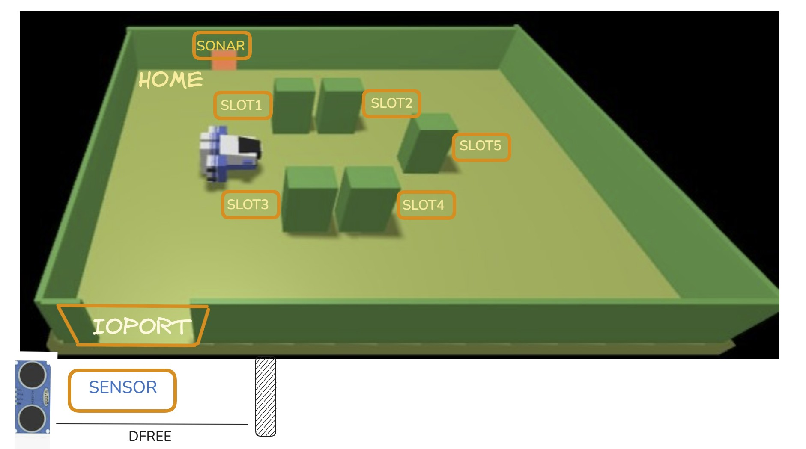
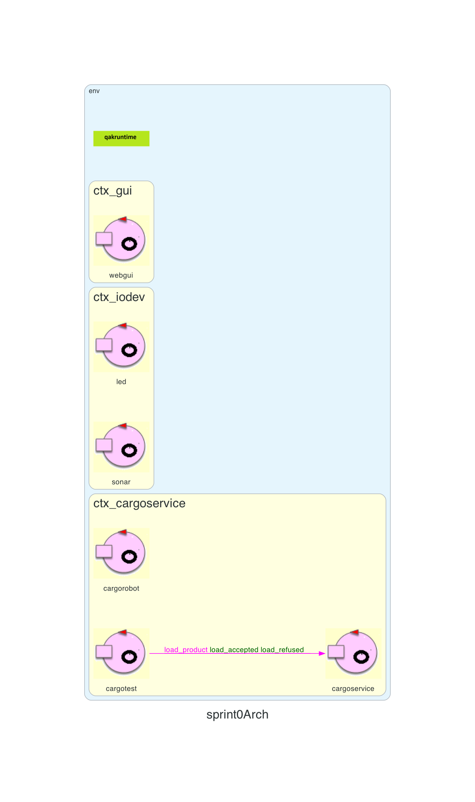

# Sprint 0 V1

# Indice
- [Obiettivi](#obiettivi) 
- [Requisiti forniti dal Commitente](#requisiti-del-commitente) 
- [Analisi dei Requisiti](#analisi-dei-requisiti)  
- [Macrocomponenti](#macrocomponenti) 
- [Architettura di Riferimento](#architettura-di-riferimento) 
- [Piano di Test](#piano-di-test) 
- [Piano di Lavoro](#piano-di-lavoro) 

# Obiettivi
In questo sprint0 i nostri obiettivi sono di formalizzare i requisiti forniti dal committente e definire il nostro problema, in questa formalizzazione saremo in grado di definire problemi che saranno poi gestiti e sviluppati in sprint da eseguire eventualmente anche in parallelo, improntare le componenti della nostra archiettura (macrocomponenti principali & interazioni tra loro sotto forma di messaggi).

# Requisiti del commitente
[Requisiti del commitente](../../requirements/README.md)

# Analisi dei requisiti

### Hold
È la stiva della nave, cioè l’[area di lavoro](#area-di-lavoro) e piatta dove vengono caricati i container con i prodotti. In questo progetto è una zona rettangolare con degli slot e una porta di ingresso/uscita (IOPort). Verrà utilizzato dall'attore CargoService.
### Cargorobot
È il robot a guida differenziale (Differential Drive Robot) incaricato di spostare i container dentro la stiva e piazzarli nello slot assegnato. Dopo il lavoro torna sempre alla sua posizione “HOME”. Ci viene gia fornito dal committente.
### Products
Sono i beni/merci che devono essere caricati sulla nave. Ogni prodotto viene messo in un container di dimensioni prefissate e registrato in un sistema.  
### Weight
Il peso del prodotto/container. Serve per verificare che non venga superato il limite massimo di carico della nave (`MaxLoad`). 
### CargoService
È il servizio software che si occupa di gestire l'hold. Quando inserisci un prodotto specificando il peso, lui restituisce un identificativo unico (`PID`). 
### Io-port
È la porta di ingresso/uscita della stiva. Davanti a questa porta c’è un sensore sonar che rileva se un container è presente. È il punto dove il prodotto viene consegnato prima che il robot lo carichi. Sarà un macrocomponente del nostro sistema. Si trova sul perimetro dell'hold.

### DDR Differential Drive Robot
È il tipo di robot mobile con due ruote motrici indipendenti. Si muove facendo girare le ruote a velocità diverse (come i robot aspirapolvere), ed è quello usato come cargorobot.

## Componenti fornite dal committente
Si elencano di seguito le componenti software fornite dal committente
### BasicRobot
Componente che governa il movimento del DDR-robot. Non è a conoscenza della tecnologia con il quale il robot è stato implementato. Dato un punto di arrivo è capace far raggiungere il DDR quel determinato punto. Pertanto conosce l'Hold e i suoi vincoli. Comunica tramite messaggi.

### SonarLed2025 
Software per la misurazione della distanza dal sonar (componente hardware) e per accendere un LED
### WENV
WENV è un ambiente di simulazione software (“Web Environment”) usato per testare il sistema, mostrare la stiva, lo stato degli slot e i movimenti del robot tramite un’interfaccia grafica web.
## Area di Lavoro

## Plain Old Java Objects (POJO)
I POJO sono essenziali per costruire il modello di dominio in DDD.  
Sono usati per:  
• Rappresentare entità con identità persistente (es. LoadedProduct)  
• Definire value object immutabili (es. LoadRequest, ValidationResult)  
• Formare aggregati, unità coerenti per la consistenza dei dati  
• Incapsulare logica di business passiva e stateless  
  
I POJO sono passivi, non gestiscono il loro stato in autonomia nel tempo in risposta a eventi esterni e non hanno code di messaggi proprie
## Attori
Il modello ad Attori si basa su entità autonome che comunicano tramite messaggi. Un Attore Qak è un componente attivo con un proprio flusso di controllo autonomo e uno stato interno.  

Le loro caratteristiche principali includono:  

• **Gestione autonoma dello stato**: Mantengono il proprio stato interno  
• **Comunicazione a messaggi**: Interagiscono esclusivamente inviando e ricevendo messaggi (Dispatch, Request, Reply, Event), promuovendo isolamento e resilienza  
• **Coda di messaggi locale**: Ogni Attore ha una coda (msgQueue) per processare i messaggi sequenzialmente, gestendo naturalmente l'esigenza di non elaborare più richieste contemporaneamente  
• **Comportamento come FSM**: Il loro comportamento può essere modellato come una macchina a stati finiti (FSM)  
• **Adatti a sistemi distribuiti e microservizi**: Il modello Qak è specificamente pensato per la progettazione di prototipi di sistemi distribuiti, con attori che si comportano come FSM, strettamente correlati all'architettura a microservizi  
• **Qak come DSL**: Il linguaggio Qak è un Domain Specific Language (DSL) che fornisce un alto livello di astrazione per definire modelli eseguibili di sistemi basati su attori, aiutando a colmare l'abstraction gap  
• **Raggruppamento in contesti**: Gli attori sono raggruppati in contesti che gestiscono le interazioni di rete tramite protocolli come TCP, CoAP, MQTT  


# Macrocomponenti
Ora che sono stati definiti i requisiti ed i concetti fondamentali che utilizzeremo procediamo a modellarne i macrocomponenti. 

### Cargorobot
Il cargorobot sarà un attore in quanto sarà incaricato di reagire ad eventi come l'arrivo di un container. Esso aggiungerà al basicrobot la possibilità di caricare e scaricare container negli appositi slot dell'Hold. 

### CargoService
Il CargoService rappresenta il nucleo della logica di business del sistema, allineandosi al concetto di "Gestione Carico" (Loading Management) identificato come Bounded Context  

Le sue responsabilità principali sono:  

**• Gestire le richieste di carico**: Riceve le richieste esterne per il carico di un prodotto e ne gestisce l'intero ciclo di vita.  
**• Orchestrare il processo**: Agisce come orchestratore della saga di caricamento. Decide se accettare o rifiutare una richiesta dopo aver eseguito le necessarie validazioni, come il controllo del peso massimo e la disponibilità di slot nella stiva  
**• Coordinare gli altri componenti**: Interagisce con gli altri macro-componenti per portare a termine il processo. Ad esempio, richiede informazioni sul prodotto (come il peso) a un servizio dedicato, verifica la disponibilità di slot interrogando il componente `hold`, e comanda al cargorobot di eseguire la movimentazione.  

Verrà modellato come un attore in quanto la comunicazione avverà con elementi eterogenei e pertanto riteniamo sia piu congruo lo scambio di messaggi come metodo comunicativo.

### Sonar
Il sonar si interfaccia con il sensore a ultrasuoni fisico, verrà montato in un nodo fisico separato (raspberry) e per tanto,facendo parte di un sistema distribuito, verrà modellato come un **attore**.
### Led
Il led anche esso si trova su un nodo fisico separato e per lo stesso motivo del sonar verrà modellato come un **attore**. Di seguito le sue responsabilità principali:

**• Fornire feedback visivo**: La sua funzione primaria è quella di segnalare visivamente la presenza di container.  
**• Esporre un'interfaccia di controllo**: Deve offrire un'interfaccia semplice per essere comandato da altri componenti, accettando messaggi come `turnOn` e `turnOff`.

### Web-gui
La web-gui è un'interfaccia che permetterà di visualizzare lo stato della stiva in tempo reale e di interagire con il sistema. Verrà modellato come un **attore** perchè dovrà comunicare tramite messaggi.
 

# Architettura di Riferimento
## Modello di comunicazione a Messaggi
Il modello ad attori sfrutta la comunicazione tramite messaggi e dai requisiti forniti siamo in grado di comprendere alcune delle interazioni che avvengo tra gli attori. Si indicano di seguito i messaggi che sono in grado di scambiarsi tra di loro. 

- ```Request load_product  : load_product(PID) ```
richiesta di carico di un prodotto con PID

- ```Reply   load_accepted : load_accepted(SLOT) for load_product``` 	restituisce lo slot assegnato

- ```Reply   load_refused  : load_refused(CAUSA) for load_product```
ritorna la causa del mancato carico

Serviranno successive decisioni per la modellazione e l'implementazioni di messaggi tra attori per ulteriori funzionalità.

# Schema dell'architettura

# Piano di Test
In questa prima fase i test servono a controllare che i prototipi dei componenti interagiscano come richiesto dal committente.

- tentativo accettato di carico
- tentativo rifiutato di carico per troppo peso
- tentativo rifiutato per mancanza di slot

```bash
State richiesta {
    println("[cargotest] Invia una nuova richiesta") color yellow
    // Invio della richiesta
    request cargoservice -m load_product:load_product(1) 
    request cargoservice -m load_product:load_product(1) 
    request cargoservice -m load_product:load_product(1) 
}
Goto waiting_for_response 

State waiting_for_response {
}

Transition t0 
    whenReply load_accepted -> loadAccepted
    whenReply load_refused  -> loadRefused

State loadAccepted {
    println("[cargotest] risposta arrivata") color blue  

    onMsg(load_accepted : load_accepted(SLOT)) {
        [# val Msg = payloadArg(0).toInt() #]
        println("[cargotest] Richiesta accettata, slot n. $Msg ") color yellow
    }
} 
Goto waiting_for_response

State loadRefused {
    onMsg(load_refused : load_refused(CAUSA)) {
        [#
        var Msg = payloadArg(0)
        #]
        println("[cargotest] Richiesta rifiutata causa : $Msg ") color yellow
    }
}
```

# Piano di Lavoro
Successivi allo sprint0 si distinuguono i seguenti sprint operativi del nostro processo Scrum

1. Sprint 1 (30h)
    - CargoService (core buisness del sistema)
    - Cargorobot
3. Sprint 2(20h)
    - Sonar
    - Led
4. Sprint 3(10h)
    - Web Gui

