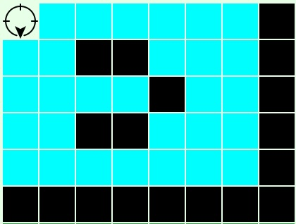

# Sprint1

## Indice
  - [Requisiti da Analizzare](#requisiti-da-analizzare)
  - [Analisi del problema](#analisi-del-problema)
    - [CargoService](#cargoservice)
    - [Considerazioni Aggiuntive (Cargoservice)](#considerazioni-aggiuntive-cargoservice)
    - [Cargorobot](#cargorobot)
    - [Considerazioni Aggiuntive (Cargorobot)](#considerazioni-aggiuntive-cargorobot)
      - [Stato del Robot e ripresa attività](#stato-del-robot-e-ripresa-attività)
      - [Carico Completo](#carico-completo)
      - [Evento di allarme](#evento-di-allarme)
    - [ProductService](#productservice)
	- [Basicorobot](#basicrobot)
  - [Messaggi tra componenti](#messaggi-tra-componenti)
    - [Contesti](#contesti)
    - [Messaggi Basicrobot](#messaggi-basicrobot)
    - [Messaggi ProductService](#messaggi-productservice)
    - [Messaggi nuovi](#messaggi-nuovi)
  - [Piano di test](#piano-di-test)
  - [Implementazione](#implementazione)
    - [Cargoservice](#cargoservice)
      - [Gestione dell'occupazione degli slot](#gestione-delloccupazione-degli-slot)
      - [Richiesta di carico prodotto](#richiesta-di-carico-prodotto)
    - [Cargorobot](#cargorobot)
      - [Gestione della posizione e dello stato](#gestione-della-posizione-e-dello-stato)
  - [Divisione dei task](#divisione-dei-task)

## Requisiti da Analizzare
L'obiettivo prefissato di questo sprint è quello di analizzare i requisiti dei componenti *cargoservice* e *cargorobot* e di ciò che sta dietro a questi. Analizzeremo il problema e affronteremo un'elaborazione di progetto. Definiremo quali sono le **interazioni** tra questi componenti e il resto del sistema, ovvero sia ciò che i componenti comunicheranno con l'esterno sia ciò che riusciranno a digerire. Al termine di questo sprint, verrà redatto un piano di test per verificare che i componenti funzionino come previsto.

I requisiti che andremo prima ad analizzare e poi ad implementare in questo sprint sono:

1. Un sistema in grado di **ricevere** una richiesta di carico di un prodotto, **accettarla** o **rifiutarla**. Il prodotto contiene un **PID** associato e il sistema deve essere in grado di verificarne la presenza nel database e il peso che non deve superare la costante MAXLOAD. 

2. Un sistema che riesca ad effettuare un **carico completo**.
    - Verifica la presenza di un container, il suo peso e la disponibilità di uno slot
    - Carico del container recandosi all'IOPort
    - Posizionamento e scarico del container nello slot corretto
    - Return to home
Dunque un sistema che sia in grado di tenere conto dello stato della stiva, tra cui slot liberi e peso totale. Deve essere in grado inoltre di indirizzare il DDR verso gli slot o la porta di destinazione.

3. Un sistema che sia in grado interrompere ogni attività in caso di malfunzionamento. Ovvero in caso di sollevamento di un evento di guasto da parte del sonar, il sistema deve essere in grado di **interrompere** ogni attività e, una volta risolti i problemi, **farle ripartire**.

## Analisi del problema
In questo Sprint ci siamo concentrati sull'analisi dei due componenti [*cargoservice*](#cargoservice) e [*cargorobot*](#cargorobot). Abbiamo analizzato il problema e le interazioni che questi componenti avranno con il resto del sistema.

### CargoService
Il cargoservice è il componente che si occuperà di gestire le richieste di carico e scarico dei container. Le richieste arriveranno da un componente esterno( il sonar emetterà un evento) e il cargoservice dovrà elaborarle in base a diversi fattori tra cui la disponibilità degli slot, il peso totale dei container e l'ordine di arrivo, per poi accettarle o rifiutarle. Verrà implementato come un **orchestrator**: si occuperà di coordinare le attività del cargorobot, di gestire le richieste di carico in base allo stato del led e infine di comunicare con la web-gui per permettere l'interazione e il controllo da parte del committente. Il `cargoservice` riceve anche eventi dal `sonar` (mock del sensore) che simulano la presenza o assenza del container, gestendo guasti e ripristini. In caso di `sonar_error`.

La nostra scelta nello sprint0 è stata quella di non modellare nessun attore per la gestione separata dell'hold ma di implementarne all'interno di cargoservice la logica di funzionamento.


Il ciclo di funzionamento del cargoservice sarà il seguente:

1. Ricezione del **PID** del prodotto (container) all'interno di una richiesta di carico grazie all'evento di container_trigger sollevato dal sonar.
2. **Verifica del peso** tramite una richiesta all'attore **productservice**. In questa richiesta viene inserito il PID del prodotto del quale si vuole conoscere il peso.
3. La risposta di productservice può essere di due tipi:
    - **PID non registrato (ERRORE)**: il PID inviato da cargoservice non è registrato nel sistema.
    - **Peso relativo al PID**: Restituisce il peso relativo al PID inviato in precedenza.
  
4. Una volta ottenuto il peso la procedura di carico viene eseguita sotto le seguenti condizioni:
- il carico attualmente ospitato sommato al carico dell'eventuale prodotto da caricare non deve la costante `MAXLOAD` (`CURRENTLOAD` + `PRODUCT_WEIGHT` <= `MAXLOAD`)
- uno dei 5 slot (4 disponibili) deve essere libero per poter ospitare il prodotto

Dunque la risposta che cargoservice darà alla richiesta di carico sarà:
- **RIFIUTO**: In caso di mancanza di una delle due condizioni sopra - Risposta di errore
- **ACCETTAZIONE**: Condizioni soddisfatte e nella risposta viene specificato lo slot in cui il prodotto dovrà essere caricato.
In caso di mancanza di una delle due condizioni verrà segnalato il relativo errore.
5. Cargoservice richiede al cargorobot di eseguire la load specificando lo slot in cui mettere il container.	
6. Il cargoservice attende che il cargorobot ritorni alla HOME (posizione 0,0 dell'hold).La risposta può essere una load_completed o una load_failed in base all'esito del caricamento.
7. cargoservice riceve in risposta l'esito della load dal cargorobot, aggiorna lo stato della stiva(peso,numero di slot liberi), emette gli eventi per ggiornare la web-gui ed è pronto per gestire nuove richieste.


#### Considerazioni Aggiuntive (Cargoservice)
In caso di evento scatenato dal Sonar (es. malfunzionamento, emergenza) il cargoservice deve interrompere ogni attività in corso e attendere ulteriori istruzioni. Per comunicare queste interruzioni a cargorobot possiamo inoltrare gli eventi che in futuro svilupperemo sul componente Sonar. Sonar in questo sprint sarà un mock.


Ogni volta che lo stato interno della hold cambia, cargoservice emetterà i seguenti eventi:
Event slot_changed : slot_changed(ID,status) 
Event sonar_changed : sonar_changed(status)
Event led_changed : led_changed(status)

Essi permetteranno alla web-gui di aggiornare dinamicamente lo stato dell'hold visualizzato.

### Cargorobot
Il cargorobot gestisce il basicrobot colmando **l'astraction gap** che si individua all'interno di basicrbot. Ovvero portando il DDR dalla semplice capacità di muoversi all'interno della mappa fornita alla possibilità di eseguire operazioni di carico e scarico dei container (eseguibili sotto forma di messaggi grazie all'implementazione sotto forma di attore). Ha conoscenza percui della posizione degli slot oltre alle informazioni della stiva (dimensione, ostacoli, perimetro, posizionamento dell'IOport).

Il cargorobot dovrà condividere con il basicrobot la conoscenza della stiva. Il basicrobot fornito dal committente possiede una sua modellazione dell'hold che consiste in un rettangolo di celle della dimensione del robot, gli ostacoli(i nostri slot), il posizionamento dell'IOport e il led.

La hold si presenta come una griglia dove ogni quadrato rappresenta una cella di dimensione pari a quella del robot


La posizione degli slot e dell'IOport secondo le coordinate con cui viene modellata la hold all'interno di basicrobot sono riportate qui sotto.

La posizione (0,0) rappresenta la HOME del robot, ovvero il punto di partenza e ritorno dopo ogni operazione. Gli slot sono posizionati in coordinate fisse all'interno della stiva, ad esempio:
- Slot 1: (1,1)
- Slot 2: (1,3)
- Slot 3: (4,1)
- Slot 4: (4,3)
- Slot 5: Slot che consideriamo sempre pieno, non utilizzabile
- IOport: (1,5)




L'attività che il cargorobot dovrà svolgere sarà la seguente:
1. Il cargorobot riceve da cargoservice una richiesta di carico di un container e lo slot in cui posizionarlo.
3. Il cargorobot si dirige verso la pickup-position e preleva il container dall'IOport.
4. Succesivamente dopo aver prelevato il container, si dirige verso lo slot fornito in precedenza e deposita il container.
5. Una volta completata l'operazione cargorobot ritorna in (0,0) HOME e notifica a cargoservice il completamento dell'operazione. 

Il movimento del robot viene gestito tramite funzionalità messe a disposizione da basicorbot24. Cargorobot si occcuperà di inviare i comandi di movimento tramite messaggi e di gestire le risposte che riceverà da basicrobot. Tramite il messaggio moverobot sarà possibile definire la posizione di destinazione del robot, basicrobot si occuperà di calcolare il percorso e di muovere il robot. Cargorobot attenderà la risposta di basicrobot per sapere se l'operazione è andata a buon fine o se è fallita (es. ostacolo imprevisto).
Le coordinate di posizionamento del robot sono memorizzate all'interno di basicrobot(disponibili tramite messaggio), mentre il posizionamento del degli slot e dell'IOport sono memorizzate all'interno di cargorobot.

### Considerazioni Aggiuntive (Cargorobot)
#### Stato del Robot e ripresa attività
Può gestire eventi `stop` e `resume` ricevuti dal `cargoservice`. Durante `stop` emette un `alarm` e sospende il basicrobot.

A questo punto inizialmente il problema analizzato è stato la ripresa dell'attività dopo un evento di interruzione. Abbiamo notato che è necessario memorizzare lo stato di spostamento del robot. In quando al momento della ripresa dell'attività il robot non è in grado (se non siamo noi a fornirgli queste informazioni) di sapere che cosa stava facendo prima dell'interruzione. Dunque tramite una variabile di stato interna al cargorobot, andremo a memorizzare lo stato del robot (es. in movimento o meno). In questo modo alla ripresa dell'attività se basicrobot precedentemente si stava muovendo riceverà una moverobot altrimenti rimarrà in attesa di un eventuale richiesta di movimento. Questo problema viene risolta dalla "returnFromInterrupt" di qak nonostante sia deprecata. Una volta analizzato il problema demandiamo all'implementatore la strada migliore da intraprendere.

#### Carico Completo
Il cargorobot deve tornare in HOME e notificare al cargoservice il completamento dell'operazione. 

#### Evento di allarme
In caso di evento scatenato dal sonar (es. malfunzionamento, emergenza) il cargorobot deve interrompere ogni attività in corso e attendere ulteriori istruzioni. 
Questo ci porta alla conclusione di dover gestire e mantenere memorizzate alcune informazioni:

- Avanzamento della richiesta (Arrivato all'IOport, Arrivato allo slot, Arrivato a HOME)
- Salvataggio della richiesta in corso (SLOT in cui effettuare il caricamento se non ancora eseguito)

Utilizzeremo *alarm(x)* per notificare a basicrobot un evento di blocco.

### ProductService

Il productservice è un componente che viene gia fornito dal committente per la registrazione e la gestione dei prodotti all'interno di un relativo Database. Esso permette la registrazione, la cancellazione e la ricerca di prodotti tramite il loro PID. Ogni prodotto ha associato un peso che verrà utilizzato dal cargoservice per verificare che il carico totale non superi la costante MAXLOAD. **Prodotto** invece sono le entità che verranno gestite. Gli attributi di un prodotto sono:

- PID (Valore Intero identifiativo del prodotto, deve essere maggiore di 0)
- Peso (Valore Reale che rappresenta il peso del prodotto, deve essere maggiore di 0)
- Nome (Stringa)

Come detto in precedenza ProductService è un componente già fornito dal committente, pertanto non verrà implementato da noi, ma ci limiteremo ad utilizzarlo per le nostre esigenze. Le interazioni che avremo con questo componente sono analizzate nel prossimo punto.

## Messaggi tra componenti

### Contesti
```
Context ctx_productservice	ip [host="cargoserviceqak" port=8111]
Context ctx_basicrobot ip [host="basicrobot24" port=8020] 
Context ctx_cargo	ip [host="localhost" port=8000]
Context ctx_webgui ip [host="webgui" port=8998] 
Context ctx_sonarhost ip[host="sonarhost" port=8999]

ctx_cargo (host="localhost" port=8000)          
├── cargorobot
├── cargoservice
└──  productservice_test

ctx_basicrobot (host="basicrobot24" port=8020)     		
└── basicrobot (ExternalQActor)

ctx_productservice (host="cargoserviceqak" port=8111)  
└── productservice (ExternalQActor)

ctx_webgui (host="webgui" port=8998)
└── webgui_test

ctx_sonar (host="sonarhost" port=8999)
└── sonar_test
```

#### Messaggi Basicrobot
(Messaggi gia presenti nell'attore fornito dal committente)
```
    Dispatch cmd       	: cmd(MOVE)         
    Dispatch end       	: end(ARG)         
    
    Request step       : step(TIME)	
    Reply stepdone     : stepdone(V)                 for step
    Reply stepfailed   : stepfailed(DURATION, CAUSE) for step

    Event  sonardata   : sonar( DISTANCE ) 	   
    Event obstacle     : obstacle(X) 
    Event info         : info(X)    

    Request  doplan     : doplan( PATH, STEPTIME )
    Reply doplandone    : doplandone( ARG )    for doplan
    Reply doplanfailed  : doplanfailed( ARG )  for doplan

    Dispatch setrobotstate: setpos(X,Y,D) //D =up|down!left|right

    Request engage        : engage(OWNER, STEPTIME)	
    Reply   engagedone    : engagedone(ARG)    for engage
    Reply   engagerefused : engagerefused(ARG) for engage

    Dispatch disengage    : disengage(ARG)

    Request checkowner    : checkowner(CALLER)
    Reply checkownerok    : checkownerok(ARG)      for checkowner
    Reply checkownerfailed: checkownerfailed(ARG)  for checkowner
    
    Event alarm           : alarm(X)
    Dispatch nextmove     : nextmove(M)
    Dispatch nomoremove   : nomoremove(M)
    
    Dispatch setdirection : dir( D )  //D =up|down!left|right

    Request moverobot    :  moverobot(TARGETX, TARGETY)  
    Reply moverobotdone  :  moverobotok(ARG)                    for moverobot
    Reply moverobotfailed:  moverobotfailed(PLANDONE, PLANTODO) for moverobot
     
    Request getrobotstate : getrobotstate(ARG)
    Reply robotstate      : robotstate(POS,DIR)  for getrobotstate

    Request getenvmap     : getenvmap(X)
    Reply   envmap        : envmap(MAP)  for getenvmap
```
#### Messaggi ProductService
(Messaggi già presenti nell'attore fornito dal committente)

```
  Request createProduct : product(String)                    
  Reply   createdProduct: productid(ID) for createProduct   
        
  Request deleteProduct  : product( ID ) 
  Reply   deletedProduct : product(String) for deleteProduct

  Request getProduct : product( ID )  
  Reply   getProductAnswer: product( JSonString ) for getProduct 
    
  Request getAllProducts : dummy( ID )
  Reply   getAllProductsAnswer: products(  String ) for getAllProducts 
```
#### Messaggi nuovi
```
//cargoservice
  Request load_product : product(ID)
  Reply   loadedProduct : slot(SLOT) for load_product
//cargorobot
  Request move_product : product(SLOT)
  Reply   movedProduct : result(SLOT) for move_product
  Reply   moveProductFailed : fail(failed) for move_product

  Event stop : stop(X)
  Event resume : resume(X)
  Event alarm : alarm(X)
//sonar
  Event container_trigger : container_trigger(X)
  Event container_absence : container_absence(X)
  Event sonar_error : sonar_error(CAUSA)
  Event problem_solved : problem_solved(CAUSA)

```
## Architettura di riferimento
Qak ci fornisce l'architettura di riferimento del prototipo che realizzeremo:


## Piano di test

Abbiamo simulato  il funzionamento di alcune componenti del sistema che al momento non sono ancora state implementate. Abbiamo deciso di implementare tramite attori mokup il comportamento del test Actor per la creazione dei prodotti e delle richiste di carico per una questione di comodità implementativa e ordine mentale, in quanto utilizzando lo stesso linguaggio di modellazione (QActor) ci è stato più semplice definire le interazioni tra i componenti.

Nella fase di test, viene mandata una richiesta dal componente di Test e gestita da `cargoservice`.

Il flusso di lavoro è il seguente:
```
test actor:
  createProduct
  |
  createdProduct
  |
  cargoservice chiama productservice
  |
  cargorobot completa e notifica
  |
  cargoservice aggiorna stato
```

Aggiunto: attore `sonar_test` che simula il comportamento del sensore sonar, gestendo ciclicamente eventi di:
- arrivo container (`container_trigger`)
- assenza (`container_absence`)
- guasti (`sonar_error`)
- ripristino (`problem_solved`)
Lo scopo è testare la capacità del sistema di interrompere e riprendere le attività automaticamente.

```
sonar_test -->  cargoservice -->  cargorobot -->  basicrobot  
      ↑               ↓
problem_solved   stop/resume
```

Prevediamo un test anche per l'interazione con la web-gui.

## Implementazione
### Cargoservice
#### Gestione dell'occupazione degli slot
Per la gestione dell'occupazione degli slot, abbiamo deciso di utilizzare una lista di booleani che rappresentano lo stato di ciascuno slot. In questo modo, possiamo facilmente verificare quali slot sono liberi e quali sono occupati. Inoltre, abbiamo definito delle variabili per tenere traccia del carico massimo e del carico attuale della stiva. Consideriamo il fatto che gli slot vengano occupati in maniera incrementale.
```
QActor cargoservice context ctx_cargo{
     [#
       	var Taken_slot=arrayListOf("false","false","false","false","true")
    	val MAX_LOAD=500
    	var CURRENT_LOAD=0
    	var Product_weight = 0
    	var Reserved_slot = 0
     #]
```
#### Richiesta di carico prodotto
Spiegazione dell'implementazione della richiesta di carico prodotto, che coinvolge la comunicazione con productservice per ottenere il peso del prodotto.
```
State check_product{
		onMsg(container_trigger: container_trigger(ID)){	
			println("[cargoservice] check del prodotto")	
			[#
				val ID=payloadArg(0)
			#]			
			request productservice -m getProduct:product($ID)	
		}
	}
```


### Cargorobot
Il cargorobot al momento di ricezione di una richiesta di carico eseguirà sempre la pipeline di esecuzione.

Movimento all'IOport:

Movimento allo slot

Ritorno alla Home:

Attesa nuova richiesta o gestione richiesta in coda:
```
State goto_IOPort{
		onMsg(move_product: product(SLOT)){
            [# CurrentRequestSlot = payloadArg(0).toInt()
            	X = posizione["IOport"]!![0]!!
				Y = posizione["IOport"]!![1]!!
            #]
            println("[cargorobot] Ricevuto move_product, slot richiesto: $CurrentRequestSlot") color yellow
            println("Posizione X: $X Y: $Y") color yellow
            request basicrobot -m moverobot:moverobot($X,$Y)
            [#delivering = true
            	
            #]
            println("sent ") color yellow
        }
	}
	
	Transition t0
	whenReply moverobotfailed-> return_home_anyway
	whenReply moverobotdone -> goto_slot
	whenInterruptEvent stop -> stop
	
	
	State goto_slot{
		println("gotoslot") color yellow
		delay 3000
		onMsg(moverobotdone  :  moverobotdone(ok)){
		[#
			X = posizione[CurrentRequestSlot.toString()]!![0]!!
			Y = posizione[CurrentRequestSlot.toString()]!![1]!!
			
		#]
		println("[gotoslot] position received") color green
		request basicrobot -m moverobot:moverobot($X,$Y)
		[#delivering = true#]
		println("gotoslot delivering: $delivering | position x: $X y: $Y") color green
		}
	}
	
	
	Transition t0
	whenReply moverobotdone -> arrived_at_slot
	whenReply moverobotfailed-> return_home_anyway
	whenInterruptEvent stop -> stop
	
	State arrived_at_slot{
		println("Arrived at slot $CurrentRequestSlot")
		println("Direction") color blue
		[#
			var Direction = orientamento[CurrentRequestSlot.toString()]!!
			#
		]
		if [#CurrentRequestSlot != 3 && CurrentRequestSlot != 4#]{
			forward basicrobot -m setdirection : dir($Direction)
		println("Direction $Direction") color blue

}
	}	
	Goto return_home
	State return_home{
		delay 3000
		//onMsg(moverobotdone  :  moverobotdone(ok)){
		[#
			X = posizione["HOME"]!![0]!!
			Y = posizione["HOME"]!![1]!!
			
		#]
		request basicrobot -m moverobot:moverobot($X,$Y)
		[#delivering = true#]
		
		}
		Transition t0
		whenReply moverobotdone -> arrived_at_home
		whenReply moverobotfailed-> load_failed
		whenInterruptEvent stop -> stop
		
		State arrived_at_home{
		println("Arrived at home")
		println("Direction") color blue
		[#
			var Direction = orientamento["HOME"]!!
			#
		]
		forward basicrobot -m setdirection : dir($Direction)
		println("Direction $Direction") color blue
		
	}
		Goto load_completed
		State return_home_anyway{
			println("returnhomeanyway")
			delay 3000
			onMsg(moverobotfailed:fail(PLANDONE)){
				[#
				X = posizione["HOME"]!![0]!!
				Y = posizione["HOME"]!![1]!!
				#]
				request basicrobot -m moverobot:moverobot($X,$Y)
				 [#delivering = true#]
			}
		}
		Transition t0
		whenReply moverobotdone -> load_failed
		whenReply moverobotfailed-> load_failed
		whenInterruptEvent stop -> stop	
```		
#### Gestione della posizione e dello stato
Per la gestione della posizione e dello stato del robot, abbiamo definito delle variabili e delle mappe hash per tenere traccia delle coordinate degli slot e dell'orientamento del robot in ciascuna posizione.
```	
QActor cargorobot context ctx_cargo{
	
	[#
		val Myname = "$name"
		var CurrentRequestSlot = 0
		var delivering = false
		val posizione = hashMapOf(
		    "HOME"     to arrayOf(0, 0),
		    "IOport"  to arrayOf(0, 4),
		    "1"    to arrayOf(1, 1),
		    "2"    to arrayOf(1, 3),
		    "3"    to arrayOf(4, 1),
		    "4"    to arrayOf(4, 3)
		)
		
		val orientamento = hashMapOf(
			"HOME"    	to "down",
			"IOport" 	to "down",
		    "1"   	to "right",
		    "2" 	to "right",
		    "3" 	to "left",
		    "4" 	to "left"
		)
		
		var X = 0
		var Y = 0
	#]
```	

## Divisione dei task

Abbiamo impiegato in totale 40 ore di lavoro per completare questo sprint, suddivise tra le varie attività come segue:
- Analisi del problema: 8 ore
- Redazione del documento: 8 ore
- Pianificazione e Sviluppo del test: 24 ore

