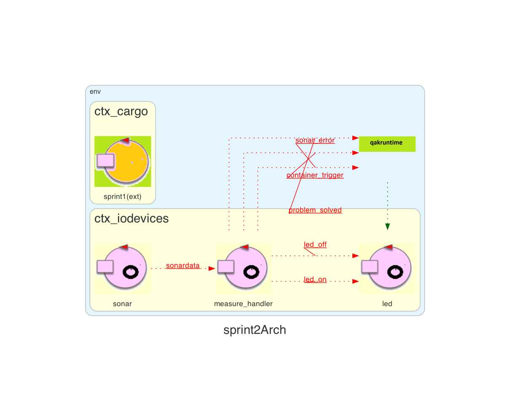

# Sprint 2

## Introduzione
In questo Sprint l'obbiettivo prefissato è quello di progettare e prototipizzare le caratteristiche degli "IO_devices" la cui necessità è emersa in fase di analisi (sprint 0). Si procederà con lo sviluppo di un prototipo funzionante che si andrà ad integrare con gli altri microservizi. 

## Requisiti
Vanno soddisfatti i seguenti requisiti:
- Implementazione di un sistema che attraverso un sensore, posizionato di fronte all'IO-PORT in grado di rilevare la presenza di un oggetto, sia in grado di comunicare al sistema che è presente un container. La rilevazione avviene quando il sonar misura una distanza **D tale che D < DFREE/2** per un tempo continuativo di almeno 3 secondi.
- Quando il sonar misura una distanza **D >= DFREE** per un tempo continuativo di almeno 3 secondi, il sistema deve interrompere le proprie attività e inoltre si deve scatenare l'accensione di un LED rosso (per comunicare un malfunzionamento del sonar).
- Nel momento in cui la distanza misurata torna ad essere **D <= DFREE** il sistema deve riprendere le proprie attività e il LED rosso deve spegnersi.
## Analisi del Problema
Analizzando i requisiti del problema, siamo in grado di identificare inanzitutto due componenti Hardware **Sonar** e **LED**. I quali saranno montati su un sistema RaspberryPI ai fini del prototipo.
### Modellazione del Sensore
Il problema iniziale che ci sorge è quello di poter permettere ai Componenti Hardware (E dei relativi componenti software) di poter comunicare ed interagire con il core-buisness del sistema. Per fare ciò, le soluzioni possibili sono due:
- Implementare il gestore come **componente** che comunichi con sonar e led modellati come **POJO**
- Implementare un **contesto (IO_devices)** che contiene al suo interno due **attori** **Sonar**  e **LED**.

La prima opzione può essere presa in considerazione per la comodità di avere un unico componente di gestione, risultà però essere meno flessibile in quanto non permette ai componenti di comunicare direttamente con il corebusiness e inoltre non rispetta il Single Responsability Principle. La seconda opzione invece permette la comunicazione con il corebusiness tramite messaggi da parte dei singoli attori e inoltre mantiene valido il principio precentemente citato. 
In breve faremo riferimento a questa architettura:

``` bash
Context ctx_iodevices
Context ctx_cargo //il contesto che contiene i microservizi cargoservice e cargorobot con cui sonar e led vogliono comunicare riferito in questo documento come "core business"
QActor sonar context ctx_iodevices{...}
QActor led context ctx_iodevices{...}
ExternalQActor sprint1 context ctx_cargo

```
### Sonar
Il sonar si deve interfacciare con il core-business sarà quindi necessario comunicare ogni evento scatenato **utile** alla modifica dello stato del sistema ( E quindi non comunicare ogni singola misurazione effettuata). Si evidenzia in questa fase la necessità di prendere una decisione archietturale in seguito ad una problematica che evidenziamo. Vogliamo comunicare al cargoservice solo informazioni utili alla modifica dello stato del robot. Pertanto, tutte le misurazioni non saranno necessarie al robot, cosi come non sarà necessario che lo stesso attore oltre al compito di comunicare al cargoservice (scatenando eventi) abbia anche il compito di leggere le misurazioni costantemente. Indi per cui la decisione è stata quella di separare queste due logiche. Permettendoci di rispettare il SingleResponsabilityPrinciple. Dunque avremo sonar_edge che sarà l'attore che avrà come compito quello di leggere tutte le misurazioni effettuate e di decidere quali saranno comunicate al secondo attore che chiameremo sonar_handler.

Le comunicazioni che il sonar_handler avrà con il contesto "cargo" sono le seguenti: 

```
Event container_trigger : container_trigger(X)    
Event sonar_error:sonar_error(CAUSA) 
Event problem_solved:problem_solved(CAUSA)
```

- L'evento **container_trigger** si scatena se D < DFREE/2 per 3 secondi, dice al cargoservice che è arrivato un container e quindi di gestire la richiesta come visto nello sprint1 (controllo del peso, slot disponibile e comunicazione al cargorobot)
- L'evento **sonar_error** si scatena se D > DFREE per 3 secondi, comunica al cargorobot di fermare ogni attività(andrare in stato "stop")
- L'evento **problem_solved** si scatena se D < DFREE in seguito ad un evento che ha evidenziato un problema con il sonar, il cargorobot lo riceve e riprende le sue attività (stato "resume")


#### Componente Fisico
Per l'interazione tra il nostro attore e il componente hardware sfrutteremo il codice python fornito dal committente che eseguirà sul RaspberryPI.

``` python
# Sonar Controller
# File: sonar.py
import RPi.GPIO as GPIO
import time
import sys

GPIO.setmode(GPIO.BCM)
GPIO.setwarnings(False)
TRIG = 17
ECHO = 27

GPIO.setup(TRIG, GPIO.OUT)
GPIO.setup(ECHO, GPIO.IN)
GPIO.output(TRIG, False)   # TRIG parte LOW

print ('Waiting a few seconds for the sensor to settle')
time.sleep(2)

while True:
  GPIO.output(TRIG, True)    #invia impulso TRIG
  time.sleep(0.00001)
  GPIO.output(TRIG, False)

  pulse_start = time.time()
  #attendi che ECHO parta e memorizza tempo
  while GPIO.input(ECHO)==0:
      pulse_start = time.time()
  # register the last timestamp at which the receiver detects the signal.
  while GPIO.input(ECHO)==1:
      pulse_end = time.time()
  pulse_duration = pulse_end - pulse_start

  # velocità del suono ~= 340m/s 
  # distanza = v*t 
  # il tempo ottenuto misura un roundtrip -> distanza = v*t/2
  distance = pulse_duration * 17165
  distance = round(distance, 1)
  print ('Distance:', distance,'cm')
  sys.stdout.flush()
  time.sleep(1)
```

### LED
Il led è un componente che permette di segnalare visivamente lo stato del sistema. Abbiamo la necessità di rilevare lo stato del sonar per poi poter comandare lo stato del led (acceso/spento). Il led dunque, dovrà attendere i messaggi emessi dal sonar e accendersi o spegnersi in base a quest'ultimi. Vogliamo modellare il led come un componente autonomo non dipendente da altre componenti.
#### Componente Fisico
Anche per il led sfrutteremo il codice python fornito dal committente per interagire con il RaspberryPI.

``` python
#ACCENSIONE LED
#file ledPython25On.py
import RPi.GPIO as GPIO 
import time

'''
----------------------------------
CONFIGURATION

'''
GPIO.setmode(GPIO.BCM)
GPIO.setup(25,GPIO.OUT)

'''
----------------------------------
main activity
----------------------------------
'''
GPIO.output(25,GPIO.HIGH)
```

``` python
#SPEGNIMENTO LED
#file ledPython25Off.py
# -------------------------------------------------------------
#
# -------------------------------------------------------------
import RPi.GPIO as GPIO 
import time

'''
----------------------------------
CONFIGURATION
----------------------------------
'''
GPIO.setmode(GPIO.BCM)
GPIO.setup(25,GPIO.OUT)

'''
----------------------------------
main activity
----------------------------------
'''

GPIO.output(25,GPIO.LOW)
```
## System Build
Come detto in precedenza il nostro obbiettivo è quello di seguire il single responsability principle ed è per questo motivo che abbiamo deciso di suddividere gli attori in base al loro compito.
### Sonar
Il componente software che andremo a sviluppare avrà come obiettivo quello di leggere i dati dal sonar.py e comunicare i messaggi al cargoservice seguendo i requisiti del committente specificati all'inizio del documento. 
Abbiamo deciso di suddividere in due attori i compiti di "sonar": sonar si occupa della lettura dei dati e measure_handler dell'invio dei messaggi.
#### Sonar -  Actor
Abbiamo modellato l'attore sonar in questo modo:
``` php
QActor sonar context ctx_iodevices{ 
		[# 
		lateinit var reader : java.io.BufferedReader
	    lateinit var p : Process	
	    var Distance = 0
		#]
	
	State start initial{
		println("$name | start") 
		
	 	[#
			p       = Runtime.getRuntime().exec("python3 /sprint2-1.0/bin/sonar.py")
			reader  = java.io.BufferedReader(java.io.InputStreamReader(p.getInputStream()))	
		#]	
		delay 2000
	}
Goto measurement
	
	State measurement{
		//println("nuova misurazione")
		[# 
			var data = reader.readLine()
			if( data != null ){
				try{ 
					val vd = data.toFloat()
					val v  = vd.toInt()
					
					// per evitare che misure a caso vengano considerate
					if(v <= 100) 
						Distance = v				
					else 
						Distance = 0
				}catch(e: Exception){
					CommUtils.outred("$name readSonarDataERROR: $e")
				}
			}
			
		#]	
		//println("$data")
		if [# Distance > 0 #] { 
		    emitlocalstream sonardata: distance($Distance)	 
		}
		delay 300
	}
	Goto measurement
}
```
#### Measure_handler -  Actor
Measure_handler intercetta l'emitlocalstream e come mostrato genera i messaggi.
``` php
QActor measure_handler context ctx_iodevices {

	[# 
		val DFREE = 20 
		
		//stati
        val START = 0
        val CONTAINER_PRESENTE = 1
        val CONTAINER_ASSENTE = 2
        val GUASTO = 3
        
		var Stato = START
		var Stato_precedente = START
		var CounterMisurazioni = 0
		
		var Guasto = false
	#]	
	
	State s0 initial{
		println("$name | start") 
	 	subscribeTo sonar for sonardata
	}
	Goto waiting_for_measurement

	
	State waiting_for_measurement {
		//println("$name | attendo") 
	}
	Transition t0
		whenEvent sonardata -> handle_measurement
		
		
	State handle_measurement {
		onMsg(sonardata: distance(X)) {
			[# 
				val M = payloadArg(0).toInt()	
				CounterMisurazioni++
			#]

			
			if [#  M < DFREE/2 #] { 
				[# 
                    Stato = CONTAINER_PRESENTE
                #]				
			if [# Guasto #] {
					println("$name | sonar ripristinato") color green
					[# Guasto = false #]
					emit problem_solved:problem_solved(CAUSA)
				}
				}

			
			if [# M >= DFREE/2 && M <= DFREE #] { 
				[# 
                    Stato = CONTAINER_ASSENTE
                #]

				if [# Guasto #] {
					println("$name | sonar ripristinato") color green
					[# Guasto = false #]
					emitlocalstream led_off:led_off(yes)
					emit problem_solved:problem_solved(CAUSA)
				}
			}
			
			if [# M > DFREE #] { 
				[# 
					Stato = GUASTO
				#]
				emitlocalstream led_on:led_on(yes)
			} 
			
			[#
				if(Stato == Stato_precedente &&
                   Stato_precedente!=START)
                {
					when(Stato) {
					    CONTAINER_PRESENTE -> {
					        if(CounterMisurazioni == 3) {
					        	CommUtils.outmagenta("Ho letto 3 volte una misura congruente quindi procedo a segnalare la presenza di un container")
        						#]
								emit container_trigger : container_trigger(1) 
								[#
					    		//CounterMisurazioni = 0 non voglio che arrivi più volte l'evento
					    			}
					    		}
					    CONTAINER_ASSENTE -> {
					    	if(CounterMisurazioni == 3) {
					        	CommUtils.outmagenta("Ho letto 3 volte una misura congruente quindi non c'è più il container'")
					    		//CounterMisurazioni = 0
					    							}
					    					}
					    GUASTO -> {
					    	if(CounterMisurazioni == 3) {
								CommUtils.outred("Guasto")	
								Guasto = true
								#]
								emit sonar_error:sonar_error(CAUSA)
								[#
								//CounterMisurazioni = 0			    		
					    								}
					    		}
					    else -> {
					    	println("Non posso entrare in questo stato, preoccupati")
					    }
					}
				} 
				else {
					Stato_precedente = Stato
					CounterMisurazioni = 1
				}
				
			#]
		}
	}
	Goto waiting_for_measurement
}
```
### Led
Dentro sonar emettiamo `Event sonar_error:sonar_error(CAUSA)` e `Event problem_solved:problem_solved(CAUSA)`. Questi due eventi permettono a questo attore di capire quando comandare l'accensione e lo spegnimento:
``` php
QActor led context ctx_iodevices{
	
	[# lateinit var p : Process #]
	
	State s0 initial{
		println("$name : starting") color cyan
		[#
 			p       = Runtime.getRuntime().exec("python3 /sprint2-1.0/bin/ledPython25On.py")	
 		#]
		delay 1000
		[#
 			p       = Runtime.getRuntime().exec("python3 /sprint2-1.0/bin/ledPython25Off.py")	
 		#
		]
		subscribeTo measure_handler for led_on
		subscribeTo measure_handler for led_off
 	}
 	Goto wait
 	
 	State wait{
 		println("$name : waiting for interrupts") color cyan
 	}
 	
 	Transition t
 		whenEvent led_on -> led_on
 		whenEvent led_off -> led_off
 		
 	State led_on{
 		println("$name : acceso") color red
 		[#
 			p       = Runtime.getRuntime().exec("python3 ledPython25On.py")	
 		#
 		]
 		
 	}
 	Goto wait
 	
 	State led_off{
 		println("$name : spento") color green
 		[#
 			p       = Runtime.getRuntime().exec("python3 ledPython25Off.py")	
 		#
 		]
 	}
 	Goto wait
}
```
## System Architecture


## Deployment e Considerazioni finali
Per l'esecuzione del sistema abbiamo pensato di generare un'immagine docker per poter gestire in maniera automatica l'avvio e la build dell'applicativo. Avviabile all'interno del raspberry.

Per il componente hardware è necessario collegare i dispositivi alla scheda nella seguente maniera:
- LED (polo positivo): pin 25
- Sonar – trigger: pin 17
- Sonar – echo: pin 27
- GND, VCC +5V, sono collegamenti che possono essere effettuati su qualunque pin disponibile