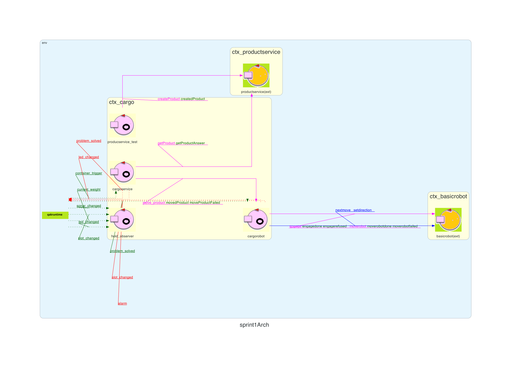

# Sprint3

## Introduzione
Nello sprint precedente ci siamo concentrati nella progettazione del sistema di misurazione e rilevazione L’obiettivo in questo sprint è introdurre un'interfaccia grafica web (WebGUI) che consenta all’utente finale di monitorare lo stato della hold, fornendo una visione chiara e aggiornata del sistema, senza interferire con la logica applicativa.

In questo sprint viene realizzata una base architetturale della WebGUI, sulla quale sarà possibile costruire e completare le funzionalità di integrazione.

### Requisiti

Il committente ha come requisito quello di poter avere un interfaccia web consultabile che permetta la rappresentazione in tempo reale dello stato della Hold.

## Analisi del problema

### Modellazione
Dai requisiti emerge che la GUI deve essere:

- Accessibile via web
- Indipendente dal sistema operativo
- Orientata alla sola visualizzazione dello stato

Per tali motivi, la WebGUI non viene modellata come un attore, ma come una applicazione web separata, in grado di comunicare con il sistema esistente e accessibile semplicemente tramite browser, indipendente dal sistema sottostante.

### Estrarre le informazioni sullo stato della hold e visualizzazione
L'attore cargoservice, in esecuzione nel contesto ctx_cargo, contesto del corebusiness del sistema aggiorna costantemente lo stato della hold. Per consentire alla GUI di visualizzare lo stato della hold, si possono esaminare molteplici modalità, come ad esempio:

- Implementare un'interfaccia RESTful nell'attore cargoservice per consentire alla GUI di effettuare richieste HTTP e ottenere lo stato della hold in formato JSON.
- Utilizzare un sistema di messaggistica (ad esempio MQTT o CoAP) per inviare aggiornamenti in tempo reale da cargoservice alla GUI ogni volta che lo stato della hold cambia.
- Implementare un meccanismo di polling nella GUI che richieda periodicamente lo stato della hold all'attore cargoservice. 
- Prevedere l' aggiornamento di una risorsa CoAP da parte di cargoservice e recuperarne lo stato con webgui inizialmente e ad ogni cambiamento.

Si suggerisce di adottare l'ultima soluzione, in quanto coerente con le tecnologie già adottate nel sistema e con i paradigmi di comunicazione utilizzati, inoltre in fase di progettazione dell'attore qak cargoservice è già stato previsto l'aggiornamento di una risorsa CoAP. Tramite questa scelta ci sarà permesso di rimanere comunque nel concetto di sistema distribuito e non solo, sarà necessario (e lo vedremo in fase di deisgn) un sistema che permetta di recuperare lo stato attuale della hold per poi aggiornarlo in maniera incrementale in base agli avvenimenti. In questo modo WebGui non avrà la necessità di ricevere comunicazioni contenenti interamente tutti i parametri di hold ma solo quelli modificati.

## System Build
Per realizzare un applicativo web come da requisiti suggeriamo l'utilizzo della tecnologia springboot che permette di realizzare una semplice logica per la gestione di pagine web dinamiche.
Si pone un secondo problema strutturale, come possiamo gestire lo stato della hold se gli aggiornamenti che provengono dal cargoservice sono incrementali? (Ogni Attore è anche una risorsa CoAP che fornisce aggiornamenti incrementali). Abbiamo pensato di risolvere questo problema implementando un primo messaggio contente tutto lo stato completo della Hold e qual'ora quel messaggio sia gia stato inviato (Flag memorizzata su webgui) i successivi messaggi vengono droppati. Dunque qual'ora una seconda webgui venisse aperta su un browser differente, riceverebbe sia gli aggiornamenti incrementali che un messaggio informativo iniziale contente lo stato attuale della hold, consentendo a due webgui separate di poter essere "sincronizzate" con il resto del sistema.

### Dati mostrati
All'interno dell'applicativo web sono visualizzati:
- Tutti e **5 gli Slot** e il loro stato (Occupato / Libero)
- Lo stato di **LED, SONAR, l'operatività del ROBOT** ed eventuli **interruzioni** che avvengono durante l'esecuzione
- Il **peso attuale** rispetto a MAXLOAD

### Architettura Logica di SpringBoot
La WebGUI segue un'architettura SpringBoot con chiare separazioni di responsabilità tra i seguenti layer:
1. Modello dati (`HoldState`): Rappresentazione immutabile dello stato della stiva, stato del sensore, led e metriche sui pesi.
2. Servizio (`HoldStateService`): Coordinatore centrale che mantiene lo stato e orchestra il broadcast ai client connessi.
3. Origine eventi (`CoapObserverService`): Osserva le risorse CoAP dal backend qak usando Eclipse Californium. Estrae eventi strutturati eseguendo del parsing sui payload. Grazie al metodo `parseAndDispatch()` la GUI e le specifiche CoAP sono disaccoppiate, consentendo facilmente simulazioni e testing.
4. Comunicazione (`WebSockerHandlerDemo`, `WebSocketConfig`): Gestione connessioni websocket e propagazione in tempo reale dello stato. Mantiene una lista delle sessioni attive e manda in broadcast lo stato serializzato in JSON a tutti i client connessi (quando lo stato cambia).
5. REST API (`SimulateController`): Fornisce endpoint HTTP per i test ed integrazioni esterne senza richiedere una connessione CoAP in backend.
6. User Interface (`HIControllerDemo`, `index.html`): Interfaccia grafica aggiornata in tempo reale. 

## System Architecture

## Piano di Test
La WebGUI dispone di una suite di test che copre tutti i componenti principali:
- Data model (`HoldState`): Inizializzazione, update di slot occupati, tracciamento dei pesi.
- CoAP parsing (`CoapObserverService`): Parsing del payload per cambiamenti degli slot, stato del sonar, stato del LED, allarmi, eventi sui pesi.
- State Management (`HoldStateService`): Propagazione dello stato e meccanismi di broadcast.
- REST API (`SimulateController`): Simulazione di eventi per il testing senza una vera connessione CoAP.
- WebSocket Handler: Gestione connessioni e instradamento dei messaggi.
- Flusso end-to-end: Scenario multi-eventi che valida il flusso completo (parsing -> update -> broadcast).